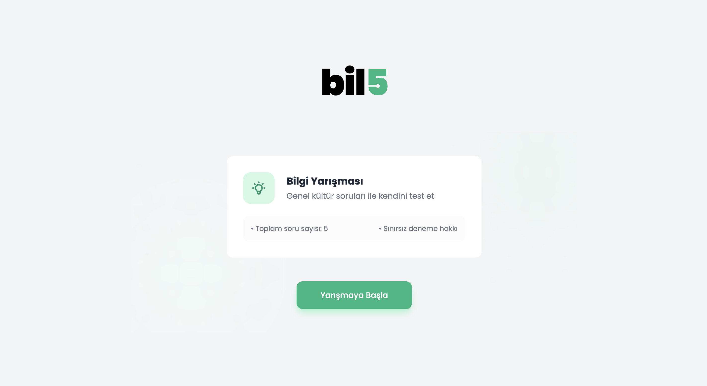
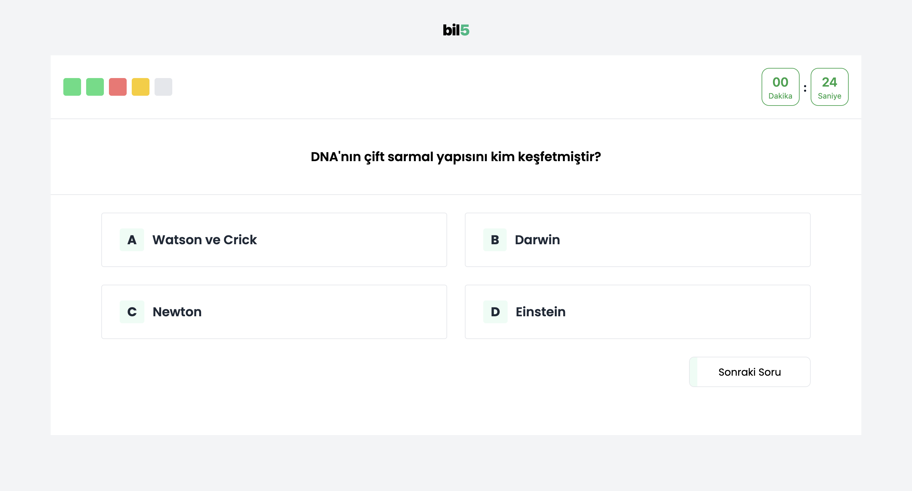

# Photos
Home Page                 |  Quiz Page
:-------------------------:|:-------------------------:
  |  

# EN - Quiz App - Bil5

This project is a quiz application where users can test themselves by answering general knowledge questions.

## Features

- Quiz with 5 randomly selected questions
- Save user answers and scores using local storage
- Question progress bar
- Timer to show elapsed time
- Modal to display results

## Installation

After cloning the project to your local environment, follow these steps to run it:

1. Clone the project:
    ```bash
    git clone https://github.com/kemalgundogdu/quizApp-bil5.git
    cd quizApp-bil5
    ```

2. Install the necessary dependencies:
    ```bash
    npm install
    ```

3. Start the application:
    ```bash
    npm start
    ```

## Technologies Used

- React
- Redux Toolkit
- Framer Motion
- Tailwind CSS

## Project Structure

- `src/`: Application source files
  - `components/`: Reusable React components
  - `pages/`: Page components
  - `store/`: Redux slices and store configuration
  - `Funcions/`: Helper functions
  - `questions.json`: Question data

## Contributing

If you would like to contribute, please send a pull request or open an issue.

## License

This project is licensed under the MIT License.

---

# TR - Quiz Uygulaması - Bil5

Bu proje, kullanıcıların genel kültür sorularını cevaplayarak kendilerini test edebilecekleri bir bilgi yarışması uygulamasıdır.

## Özellikler

- Rastgele seçilen 5 soru ile bilgi yarışması
- Kullanıcı cevaplarını ve puanlarını yerel depolama (localStorage) ile saklama
- Soru ilerleme çubuğu
- Zamanlayıcı ile geçen süreyi gösterme
- Sonuçları gösteren modal

## Kurulum

Projeyi yerel ortamınıza klonladıktan sonra aşağıdaki adımları izleyerek çalıştırabilirsiniz:

1. Projeyi klonlayın:
    ```bash
    git clone https://github.com/kemalgundogdu/quizApp-bil5.git
    cd quizApp-bil5
    ```

2. Gerekli bağımlılıkları yükleyin:
    ```bash
    npm install
    ```

3. Uygulamayı başlatın:
    ```bash
    npm start
    ```

## Kullanılan Teknolojiler

- React
- Redux Toolkit
- Framer Motion
- Tailwind CSS

## Proje Yapısı

- `src/`: Uygulama kaynak dosyaları
  - `components/`: Yeniden kullanılabilir React bileşenleri
  - `pages/`: Sayfa bileşenleri
  - `store/`: Redux dilimleri ve mağaza yapılandırması
  - `Funcions/`: Yardımcı fonksiyonlar
  - `questions.json`: Soru verileri

## Katkıda Bulunma

Katkıda bulunmak isterseniz, lütfen bir pull request gönderin veya bir sorun (issue) açın.

## Lisans

Bu proje MIT Lisansı ile lisanslanmıştır.
